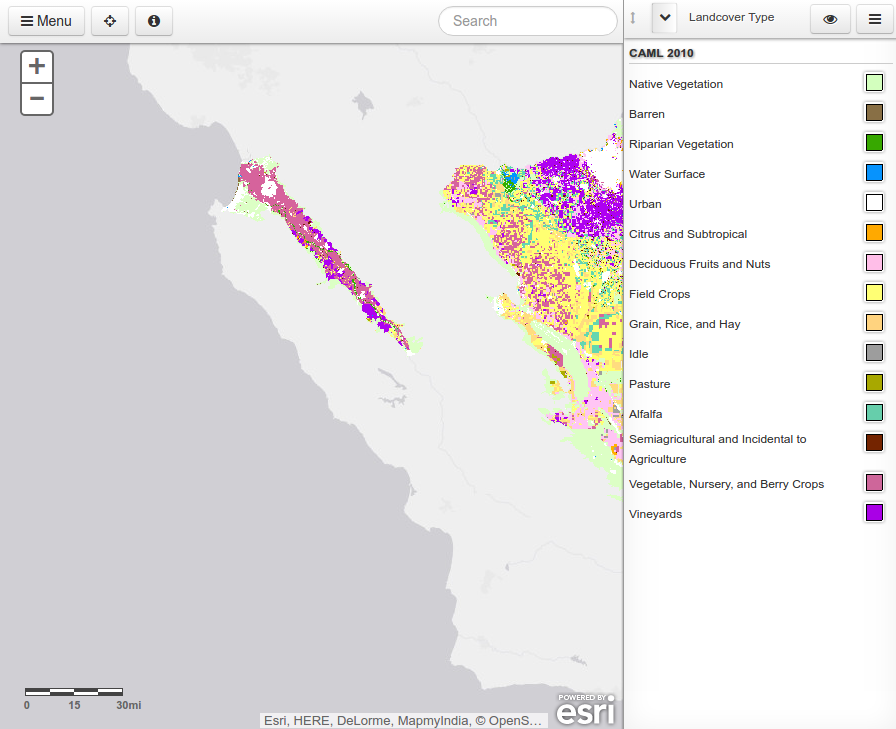
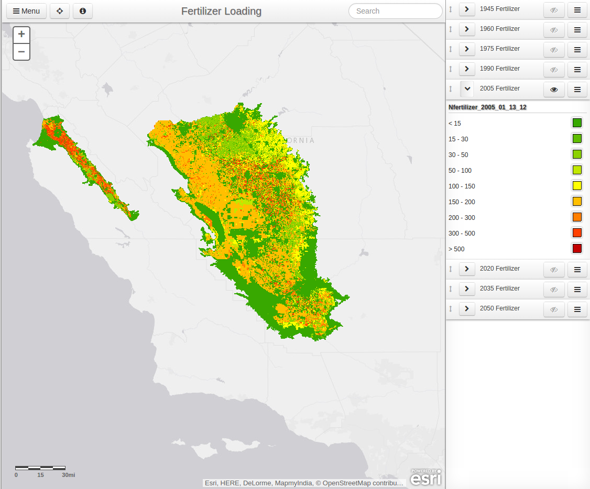
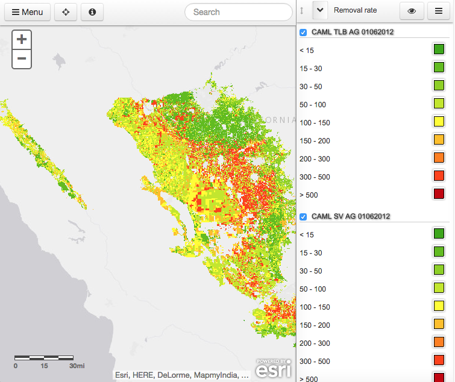
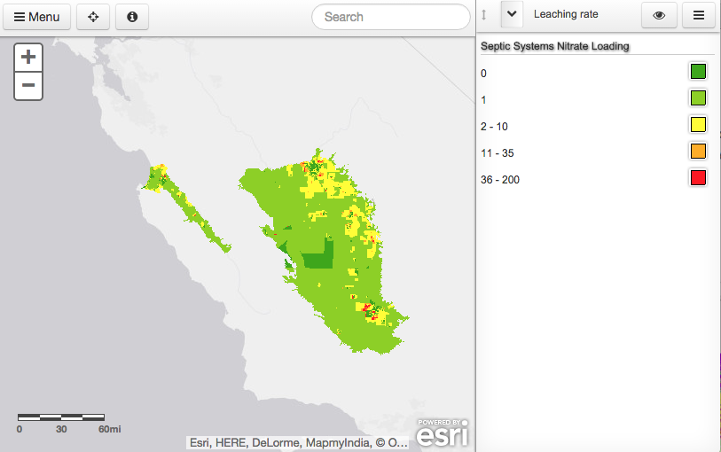

# Nitrates Maps

The following page gives access to the online maps available relating
to the Groundwater Nitrates study.  They are organized by technical
report, and carry the same figure numbers.

## Technical Report 2

## Online Maps

 |
 --- |
 Figure 2. Overview of Crop types for 2010. |

  |
 --- |
 Figure 4. Current typical annual fertilization rates (1 kg/ha/yr = 1.1 lbs/ac/yr) in irrigated agricultural cropland of the study area. |

  |
 --- |
 Figure 5. Current annual nitrogen removal rate in harvested materials.|

  |
 --- |
 Figure 6. Nitrogen application reduction needed to reduce groundwater nitrate loading to less than 35
kg N/ha/crop, compared with average nitrogen applied (synthetic fertilizer and manure) and nitrogen
harvested. |

  |
 --- |
 Figure 7. Estimated historical agricultural development in the study area (not including alfalfa) |

  |
 --- |
 Figure 8. Septic-derived nitrate leaching rates within the study area. |
