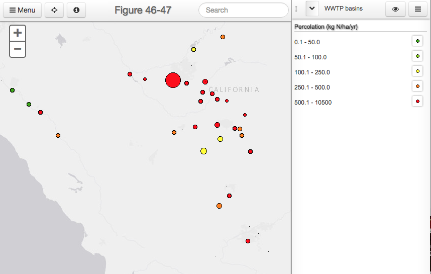
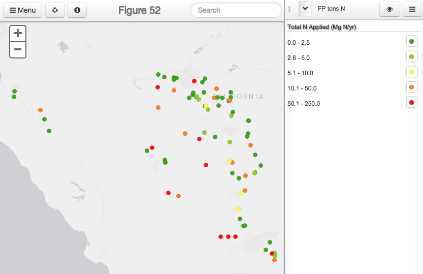
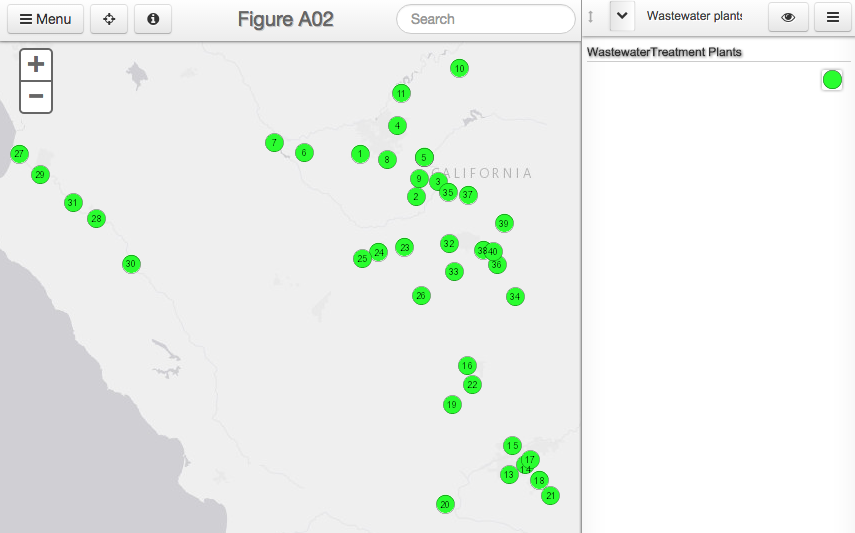

# Nitrates Maps

The following page gives access to the online maps available relating
to the Groundwater Nitrates study.  They are organized by technical
report, and carry the same figure numbers.

## Technical Report 2

## Online Maps

|  |
| --- |
| Figure 2. Overview of Crop types for 2010. |

 

|  |
| --- |
| Figure 4. Current typical annual fertilization rates (1 kg/ha/yr = 1.1 lbs/ac/yr) in irrigated agricultural cropland of the study area. |

 
 
  |
 --- |
 Figure 5. Current annual nitrogen removal rate in harvested materials (1 kg/ha/yr = 1.1 lbs/ac/yr) derived from county reports of harvested area and harvested tonnage for each of 58 crop categories. |
 
  |
 --- |
 Figure 8. Septic-derived nitrate leaching rates within the study area. |
 
  |
 --- |
 Figure 9. Simulated synthetic fertilizer application on cropland, including alfalfa, after accounting for the application of manure as fertilizer on dairy cropland. |
 
  |
 --- |
 Figure 10. Simulated land applied N from dairy manure (land applied on dairy cropland), and from WWTP/FP effluent and biosolids. This map represents results for the hypothetical “Scenario D” (all manure is land applied on dairies, representing 62% of animal N excretion, no manure is exported from dairies). |
 
  |
 --- |
 Figure 11. Simulated land applied N from dairy manure (showing only land applied N on dairy cropland, but not exported dairy manure N applications), and from WWTP/FP effluent and biosolids. This map represents results for Scenario A-C (a total of 24% of animal N excreted is land applied on dairies). Units [kg N/ha/yr] | 
 
   |
 --- |
 Fig12 Simulated land application of dairy manure N exported from dairies and land applied within the county of origin at rates proportional and in addition to typical N fertilizer needs in each crop (see Figure 4). Total manure exports represent 38% of animal N excreted (“Scenario C (by County)”). |
 
   |
 --- |
 Figure 13. Simulated land application of dairy manure N exported from dairies and land applied across the study area (not restricted to the county of origin) at rates proportional and in addition to typical N fertilizer needs in each crop (see Figure 4). Total manure exports represent 38% of animal N excreted (“Scenario C (study area)”). Unit [kg N\ha\yr]|
 
   |
 --- |
 Figure 14. Simulated nitrogen harvested in 2005 from all cropland including alfalfa. The simulation assumes 1.7 annual crops in seven vegetable crops (broccoli, brussels sprouts, cabbage, cauliflower, celery, lettuce, spinach) and double-cropping of all corn acreage with winter grain. Units [kg N\ha\yr]|
 
   |
 --- |
 Figure 15. Simulated groundwater nitrate loading from all sources including cropland. Simulation of the hypothetical “Scenario D”: All land applied manure N (62% of animal N excreted) is applied to corn, grain, and other field crops (not including alfalfa) under the direct management of dairies (no manure N exports). |
 
   |
 --- |
 Figure 16. Simulated groundwater nitrate loading from all sources including cropland. Simulation of the hypothetical “Scenario C (by county)”: hypothetically exported manure N from dairies (38% of animal N excretion) is land applied as soil amendment within the county of origin.|
 
   |
 --- |
 Figure 17. Simulated groundwater nitrate loading from all sources including cropland. Simulation of the hypothetical ”Scenario C (study area)”.|
 
  |
 --- |
 Figure 18. Simulated groundwater nitrate loading from all sources including cropland. Simulation of the hypothetical “Scenario B (by county)”.|
 
  |
 --- |
 Figure 19. Simulated groundwater nitrate loading from all sources including cropland. Simulation of the hypothetical “Scenario B (study area)”.|
 
  |
 --- |
 Figure 20. Simulated groundwater nitrate loading from all sources including cropland. Simulation of the hypothetical “Scenario A”.|
 
  |
 --- |
 Figure 21. Groundwater loading from non-cropland sources including leaky sewer lines, turf areas, golf courses, WWTP/FP percolation basins, dairy manure lagoons, and animal corrals.|
 
  |
 --- |
 Figure 27. Coarse and fine scale CAML classification at the state level and study area.|
 
  |
 --- |
 Figure 28. Current annual nitrogen removal rate in harvested materials.|
 
  |
 --- |
 Figure 29. BAU modeling scenario. UPlan land use classes.|
 
  |
 --- |
 Figure 30. BAU – Agriculture removal modeling scenario.|

  |
 --- |
 Figure 31. Smart Growth – Agriculture removal modeling scenario.|
 
  |
 --- |
 Figure 38. 1946 Land Use from DWR Mapping.|
 
  |
 --- |
 Figure 39. 1960 Land cover.|

  |
 --- |
 Figure 40. 1977 Land cover.|
 
 
  |
 --- |
 Figure 41. 1990 Land use.|
 
  |
 --- |
 Figure 42. Wastewater treatment plants and food processing facilities.|
 
  |
 --- |
 Figure 43. Wastewater treatment plants: Total applied nitrogen (metric tons N/Yr)w.|
 
  |
 --- |
 Figure 44-45. Wastewater treatment plants: Total nitrogen applied (Mg N/Yr) of discharge to irrigated agriculture.|
 
   |
 --- |
 Figure 44-45. Wastewater treatment plants: Total N concentration (mg/L) of discharge to percolation basins.|
 
  |
 --- |
 Figure 46-47. Wastewater treatment plants: kg N/ha/yr of applied nitrogen to irrigated agriculture.|
 
   |
 --- |
 Figure 46-47. Wastewater treatment plants: kg N/ha/yr of applied nitrogen to percolation basins.|
 
   |
 --- |
 Figure 48. Annual metric tons of biosolids produced by surveyed WWTPs.|
 
  |
 --- |
 Figure 49. Large land application operations and WWTPs reporting direct land application of biosolids: Total annual mass of nitrogen [color] and hectarage in ha [diameter].|
 
   |
 --- |
 Figure 50. Large land application operations and WWTPs reporting direct land application of biosolids: kg N/ha/yr [color] and hectarage in ha [diameter].|
 
   |
 --- |
 Figure 51. Food processor type distribution .|
 
  |
 --- |
 Figure 52. Total metric tons of nitrogen applied annually from food processor discharge.|
 
  |
 --- |
 Figure 53-54. Tulare Lake Basin and Salinas Valley food processors: total nitrogen applied (Mg N/Yr) of discharge to irrigated agriculture.|
 
   |
 --- |
 Figure 53-54. Tulare Lake Basin and Salinas Valley food processors: Hectarage (ha) and total N concentration (mg/L) of discharge to percolation basins.|
 
 
  |
 --- |
 Figure 55-56. Tulare Lake Basin and Salinas Valley food processors: kg N/ha/yr of applied nitrogen to irrigated agriculture .|

 
   |
 --- |
 Figure 55-56. Tulare Lake Basin and Salinas Valley food processors: kg N/ha/yr of applied nitrogen to percolation basins.|
 

  |
 --- |
 Figure 57. Sanitary sewer overflows in the Tulare Lake Basin and Salinas Valley reported in 2011.|
 
  |
 --- |
 Figure 58. Percent of households on septic systems, by blockgroup, from 1990 census data, in the study area.|
 
   |
 --- |
 Figure 59. Septic systems per hectare, in the study area.|
 
   |
 --- |
 Figure 60. Septic-derived nitrate leaching rates within the study area.|
 
   |
 --- |
 Figure 61. Atmospheric N deposition, spatially distributed across the study area, based on the Community Multiscale Air Quality model developed by U.S. EPA.|
 
   |
 --- |
 Figure A01. Food processor locations corresponding with facility numbering in Appendix Table 8.|
 
   |
 --- |
 Figure A02. Wastewater treatment plant locations corresponding with facility numbering in Appendix Table 8.|
 
